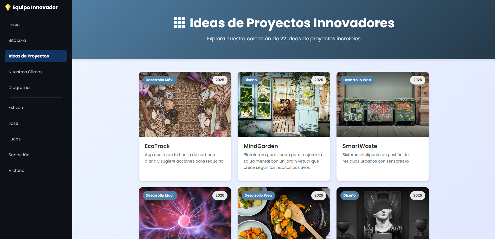
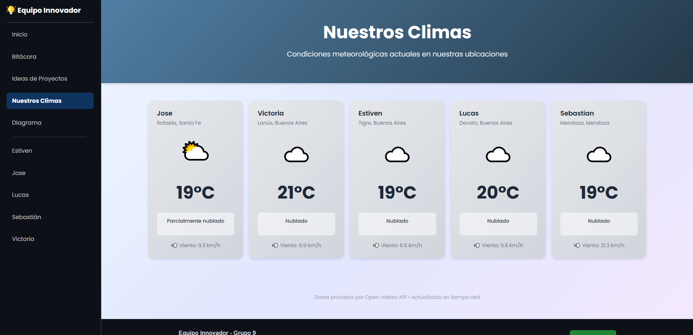
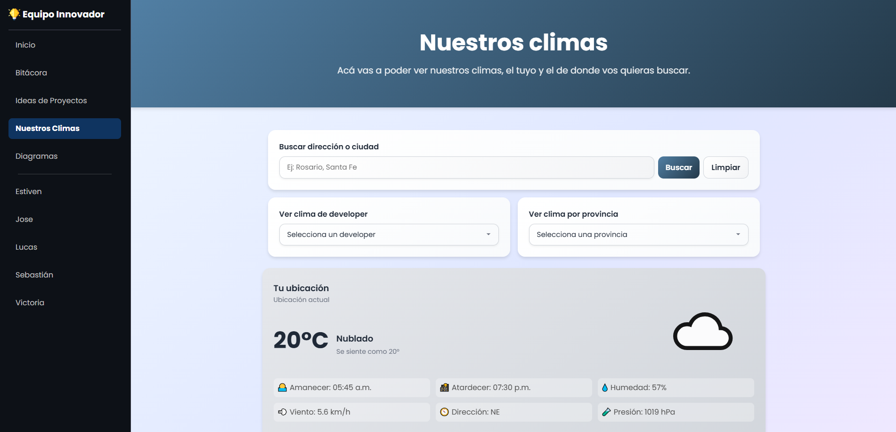
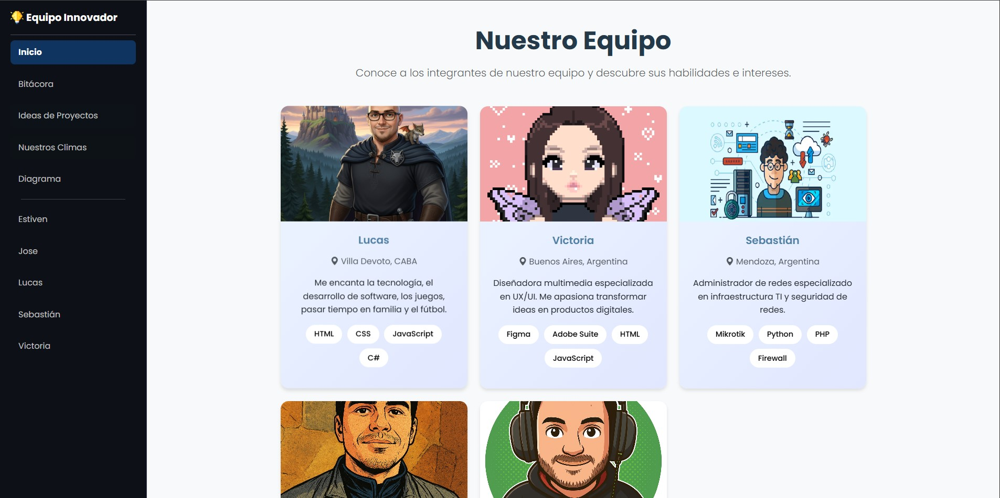
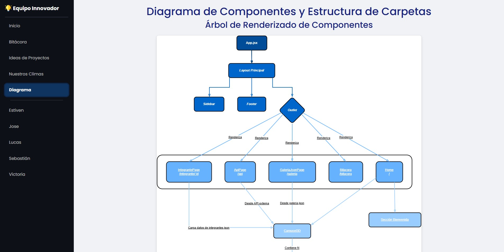
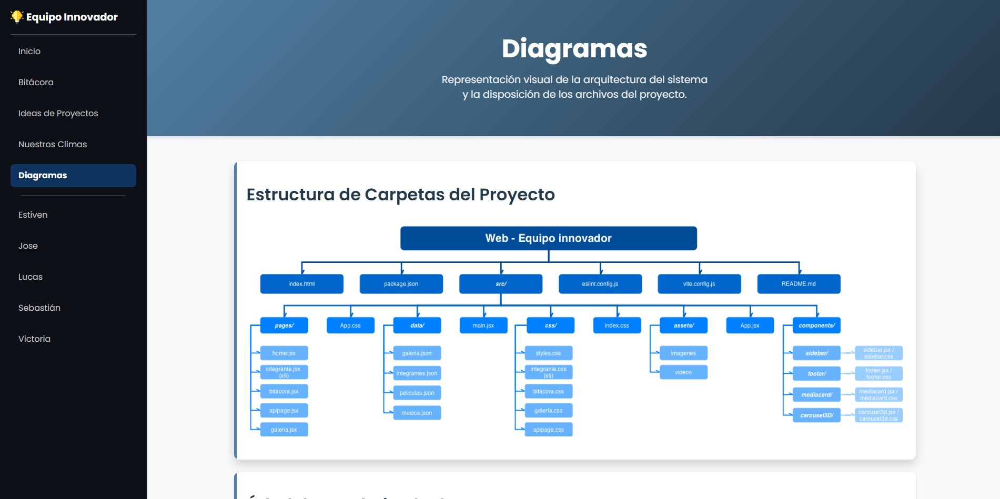

# Proyecto Final: Single Page Application con React

### **Carrera:** Técnico Superior en Desarrollo de Software

### **Materia:** Desarrollo Frontend

### **Profesor:** LUCIANO ARIEL MARTINEZ

### **Año:** 2025

-----

## Equipo Innovador - Grupo 9

  * Sebastián Gutierrez
  * Estiven Fernandez
  * Lucas Tarantino
  * Jose Luis Colombo
  * Victoria Sobral

-----
## Mejoras de la Última Entrega

A continuación, se detallan las mejoras implementadas en esta entrega según las propuestas de la asignatura.

### 1. Carga Progresiva en Galería de Proyectos
En la página de proyectos (`GaleriaJsonPage`), se implementó la carga progresiva de las tarjetas. Ahora, los proyectos aparecen a medida que el usuario se desplaza hacia abajo, mejorando el rendimiento inicial de la página.

**Antes de las mejoras:**


**Después de las mejoras:**


### 2. Navegación con Animaciones Suaves
Se agregaron transiciones suaves al cambiar de página para mejorar la experiencia de usuario y la fluidez de la navegación en todo el sitio.

**Antes de las mejoras:**


**Después de las mejoras:**


### 3. Filtros de Búsqueda en Galería de Proyectos
Se incorporaron filtros de búsqueda en la página de proyectos, permitiendo a los usuarios encontrar proyectos específicos más fácilmente según distintos criterios.

**Antes de las mejoras:**



**Después de las mejoras:**


### 4. Mejoras en la Página del Clima
La página del clima (`ApiPage`) ahora detecta y muestra automáticamente el clima de la ubicación actual del usuario. Además, se añadieron filtros para buscar el clima en otras localidades.

**Antes de las mejoras:**



**Después de las mejoras:**



### 5. Carrusel 3D Interactivo en la Página de Inicio
Se implementó un carrusel 3D en la página de inicio (`Home`) que muestra tarjetas animadas de los integrantes del equipo. Al interactuar con cada tarjeta, los usuarios pueden acceder a las redes sociales y ver las habilidades de cada miembro.

**Antes de las mejoras:**



**Después de las mejoras:**


### 6. Armonización de Estilos Visuales
Se realizaron mejoras visuales en diversas páginas, como por ejemplo en la de `Diagrama`, para unificar y armonizar el estilo general del sitio, logrando una apariencia más coherente y profesional.

**Antes de las mejoras:**



**Después de las mejoras:**



-----

## Descripción del Proyecto

Este proyecto es una **Single Page Application (SPA)** desarrollada con **React** y **Vite**, como parte de la materia Desarrollo Frontend en el *Instituto de Formación Técnica Superior N°29*.

El objetivo principal es transformar un sitio web estático en una aplicación moderna, interactiva y modular, integrando componentes dinámicos como una API de clima en tiempo real.

-----

## Características Principales

  - **Navegación fluida** sin recargar la página gracias a **React Router DOM**.
  - 🎥 **Video de fondo** en la sección principal para un mayor impacto visual.
  - ☀️ **Integración con API de clima** (Open-Meteo) mostrando la temperatura de Buenos Aires en tiempo real.
  - 🧩 **Componentes reutilizables** y organizados por secciones (Home, Bitácora, Integrantes, Victoria, etc.).
  - 📱 **Diseño responsive** utilizando **Bootstrap** y CSS personalizado.
  - ⚡ **Configuración optimizada** con **Vite** para un entorno de desarrollo rápido y eficiente.

-----

## Estructura del Proyecto

```
src/
├── assets/         # Imágenes, videos y recursos multimedia
├── components/     # Componentes reutilizables (Navbar, Footer, etc.)
├── pages/          # Páginas principales (Home, Bitacora, Victoria, etc.)
├── css/            # Estilos CSS personalizados
├── App.jsx         # Enrutamiento principal de la SPA
└── main.jsx        # Punto de entrada de la aplicación
```

-----

## Tecnologías Utilizadas

| Tecnología       | Descripción                                   |
| ---------------- | --------------------------------------------- |
| **React** | Biblioteca principal para la interfaz de usuario. |
| **Vite** | Entorno de desarrollo rápido y moderno.       |
| **Bootstrap/CSS**| Estilos visuales y diseño responsive.         |
| **Open-Meteo API** | Consulta de datos meteorológicos en tiempo real. |
| **React Router DOM** | Manejo de rutas en la SPA.                    |

-----

## Objetivos del Proyecto

  - Aplicar los conceptos de **componentización y reutilización** de React.
  - Integrar **servicios externos** mediante APIs públicas.
  - Implementar una **interfaz responsiva** y atractiva.
  - Practicar el control de versiones con **Git y GitHub**.

-----

## Instalación y Ejecución Local

Si deseas ejecutar el proyecto en tu máquina local, sigue estos pasos:

1.  **Clonar el repositorio:**

    ```sh
    git clone https://github.com/josecolombotk/desarrollo-frontend-ifts29-2.git
    ```

2.  **Entrar en el directorio del proyecto:**

    ```sh
    cd desarrollo-frontend-ifts29-2
    ```

3.  **Instalar dependencias:**

    ```sh
    npm install
    ```

4.  **Iniciar el servidor de desarrollo:**

    ```sh
    npm run dev
    ```

5.  **Abrir en el navegador:**
    Luego, visita [`http://localhost:5173`](https://www.google.com/search?q=http://localhost:5173) en tu navegador.
